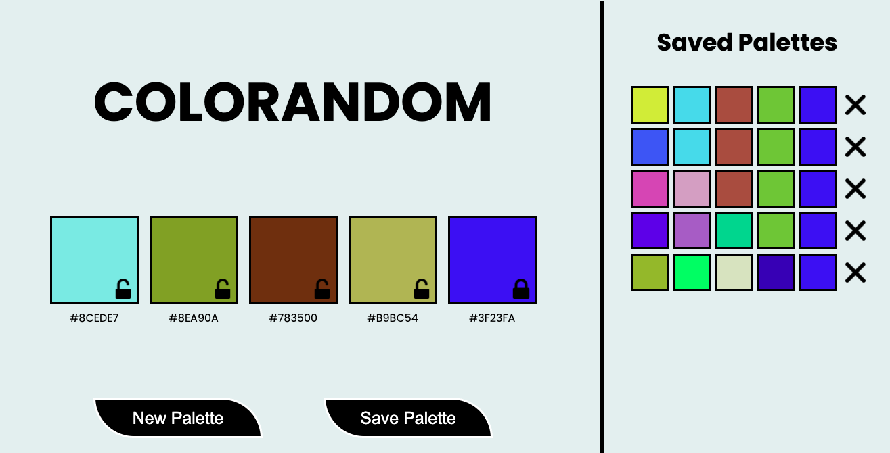

### Live GitHub Site:
[//]: <> (What site can a person access your live site?)
https://zachwolek.github.io/coloRandomProject/

### Abstract:
[//]: <> (Briefly describe what you built and its features. What problem is the app solving? How does this application solve that problem?)
We developed a webpage that generates fives random colors in five boxes. A "New Palette" button will generate five randomized hexadecimal colors, and a "Save Palette" button will store the five colors to a column on the right hand of the page. If the user wishes to keep any of the randomly generated colors, the user will have the ability to "lock" the color in place by clicking an image of a lock that will transition from an "unlocked" to "locked" image. On the right hand column, the user has the ability to delete any array of saved color boxes by clicking an "X" button to the right of the images. 

### Installation Instructions:
[//]: <> (What steps does a person have to take to get your app cloned down and running?)
1) Access the form here: https://github.com/zachwolek/coloRandomProject
2) Copy the SSH repository `URL git@github.com:zachwolek/coloRandomProject.git`
3) Open terminal and 'cd' into the directory you wish to clone 
4) Clone the repository by submitting `git clone git@github.com:zachwolek/coloRandomProject.git`

### Preview of App:
[//]: <> (Provide ONE gif or screenshot of your application - choose the "coolest" piece of functionality to show off.)
The project has the ability to lock images and reshuffle the others, the image will transtion to a locked lock when the background color will remain upon shuffle 

### Context:
[//]: <> (Give some context for the project here. How long did you have to work on it? How far into the Turing program are you?)
The group members recieved the project in their fourth week  Turing School of Software & Design, in the first school "module" of four. The group had a week to work on the project outside of class hours. 

### Contributors:
[//]: <> (Who worked on this application? Link to their GitHubs.)
Laurel Bonal: https://github.com/laurelbonal
Brandon Doza: https://github.com/BrandonDoza
David Swatzell: https://github.com/Swatzell
Zach Wolek: https://github.com/zachwolek/

### Learning Goals:
[//]: <> (What were the learning goals of this project? What tech did you work with?)
The learning goals of the project were to develop an understanding of integrating CSS, Javascript, and HTML. Specifically, how to simulteously manage input on the DOM and data model. Through the project we were able to display randomly generated colors and save them, allowing the user to fully delete them from both the DOM input and the database. We worked with CSS, Javascript, and HTML. 

### Wins + Challenges:
[//]: <> (What are 2-3 wins you have from this project? What were some challenges you faced - and how did you get over them?)
 1) Communal effort on debugging. Taking time to invest in a group atmosphere where everyone had the ability to contribute was so influential toward staying ahead of schedule and catching errors early that would have otherwise created problems later 
 2) Brainstorm culture also shared new solutions across team members. As we continue to learn the unlimited potential in web development, our group shared different strategies to problem solve that opened up our burgeoning minds
 3) We are proud of the minimal code we were able to create, and are genuinely curious to hear ways we could have minimalized it further. 